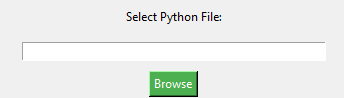
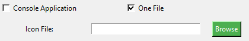

# 🐍 Py2Exe Converter

Welcome to **Py2Exe Converter**! This tool provides a simple and intuitive graphical interface to convert your Python scripts into standalone Windows executables (.exe) using **PyInstaller**.

## 🎉 Features

- 🗂️ **File Selection**: Browse and select your `.py` file with ease.
- 🖥️ **Console or GUI Application**: Choose whether your application runs in a console or as a GUI.
- 📦 **One File**: Bundle everything into a single executable file.
- 🎨 **Custom Icon**: Option to add a custom icon to your executable.
- 🛠️ **Easy Conversion**: Just click the button and your `.py` file is converted into an `.exe`.

## 🖥️ How to Use

1. **Clone the Repository**:
   ```bash
   git clone https://github.com/hu5o-dev/Py2Exe.git
   ```
2. **Install Dependencies**:
   Make sure you have PyInstaller installed. If not, install it via pip:
   ```bash
   pip install pyinstaller
   ```
3. **Run the Application**:
   ```bash
   python py2exe_converter.py
   ```
4. **Convert Your Python Script**:
   - Select your `.py` file.
   - Choose your desired options (console, one file, icon).
   - Click **"Convert to EXE"**.

## 📝 Requirements

- Python 3.x
- PyInstaller

## ⚙️ Example

Here’s a quick walkthrough of how to convert your Python script to an `.exe`:

1. **Select your `.py` file**:
   

2. **Choose your options**:
   

3. **Click Convert**:
   

4. **Done!** Your executable is ready to use.

## 🚀 Getting Started

1. **Fork and clone** the repository to start making changes.
2. **Submit a pull request** if you have improvements or bug fixes.

## 📄 License

This project is licensed under the MIT License - see the [LICENSE](LICENSE) file for details.
